# DroneDeploy Email Generation System

[](https://github.com/Mertsukusu/llm-email-generator/actions)
[](https://www.python.org/downloads/release/python-3110/)
[](https://www.docker.com/)
[](https://github.com/Mertsukusu/llm-email-generator/actions)
[](https://github.com/Mertsukusu/llm-email-generator/actions)

## Overview
Generates personalized outbound emails for construction conference speakers, inviting them to DroneDeploy's booth #42. The system uses AI-powered company categorization and automated email generation with robust error handling and retry mechanisms.

## Features

### 🚀 **Core Functionality**
- **Web Scraping**: Async scraping with local HTML fallback
- **AI Classification**: Google Gemini 2.5 Flash for company categorization
- **Email Generation**: Personalized emails based on company type and role
- **Data Validation**: Pydantic models for input validation
- **Rate Limiting**: API quota management with exponential backoff
- **Retry Logic**: Tenacity-based retry mechanism for API failures

### 🧪 **Testing & Quality**
- **Unit Tests**: 23 comprehensive tests with pytest
- **Mock Testing**: No real API calls during testing
- **Coverage**: Full coverage of core functionality
- **Error Handling**: Comprehensive edge case testing

### ⚙️ **Configuration**
- **Centralized Config**: Single config.py for all settings
- **Environment Variables**: Secure API key management
- **Flexible Settings**: Easy customization of limits and delays

## Project Structure

```
dd_gtm_ai_eng_exercise/
├── main.py                 # Main orchestration script
├── config.py            # Centralized configuration
├── models.py             # Pydantic data models
├── requirements.txt      # Python dependencies
├── README.md            # This file
├── .env                 # Environment variables (create from .env_sample)
├── in/
│   └── speakers.html    # Local HTML fallback
├── out/
│   └── email_list.csv  # Generated emails output
├── tests/               # Unit tests
│   ├── conftest.py     # Test fixtures
│   ├── test_main.py    # Main logic tests
│   ├── test_scraper.py # Scraper tests
│   └── test_categorizer.py # Categorizer tests
└── utils/               # Core modules
    ├── scraper.py      # Web scraping logic
    ├── categorizer.py  # Company classification
    └── email_generator.py # Email generation
```

## Setup

### 1. Create Virtual Environment
```bash
python -m venv venv
source venv/bin/activate  # On Windows: venv\Scripts\activate
```

### 2. Install Dependencies
```bash
pip install -r requirements.txt
```

### 3. Configure Environment
```bash
cp .env_sample .env
# Edit .env and add your Google Gemini API key
echo "GOOGLE_API_KEY=your_api_key_here" > .env
```

## Usage

### Basic Usage
```bash
python main.py
```

### Advanced Usage
```bash
# Run with debug logging
python -c "
import logging
logging.basicConfig(level=logging.DEBUG)
exec(open('main.py').read())
"
```

## 🔄 Continuous Integration

### **GitHub Actions CI Pipeline**

This project includes a comprehensive CI/CD pipeline that automatically:

- **✅ Runs on every push** to `main`/`master` branch
- **✅ Triggers on pull requests** for code review
- **✅ Tests on Ubuntu Latest** with Python 3.11
- **✅ Installs all dependencies** from `requirements.txt`
- **✅ Runs all 23 unit tests** with pytest
- **✅ Generates coverage reports** with codecov integration
- **✅ Tests Docker build** and container functionality
- **✅ Performs security scans** with safety and bandit
- **✅ Validates code quality** with linting tools

### **CI Pipeline Features**

| **Stage** | **Purpose** | **Tools** |
|-----------|-------------|-----------|
| **Code Checkout** | Get latest code | `actions/checkout@v4` |
| **Python Setup** | Install Python 3.11 | `actions/setup-python@v4` |
| **Dependency Cache** | Speed up builds | `actions/cache@v3` |
| **System Dependencies** | Install gcc for compilation | `apt-get` |
| **Python Dependencies** | Install from requirements.txt | `pip` |
| **Linting** | Code quality checks | `flake8`, `black`, `isort` |
| **Testing** | Run all 23 tests | `pytest` with coverage |
| **Security** | Vulnerability scanning | `safety`, `bandit` |
| **Docker Testing** | Container validation | `docker build/run` |
| **Coverage Upload** | Code coverage reporting | `codecov` |

### **Build Status**

[](https://github.com/Mertsukusu/llm-email-generator/actions)

**Current Status:** ✅ All tests passing | 🐳 Docker working | 🔒 Security clean

### **Local CI Testing**

```bash
# Run the same tests as CI locally
pytest -v --tb=short --cov=utils --cov=main --cov-report=xml

# Test Docker build (same as CI)
docker build -t drone-deploy-email-generator .

# Run security scans
pip install safety bandit
safety check
bandit -r .
```

## 🚀 Running with Docker

### Build the Docker Image
```bash
# Build the Docker image
docker build -t drone-deploy-email-generator .

# Build with a specific tag
docker build -t drone-deploy-email-generator:latest .
```

### Run the Container

#### Option 1: Using .env file (Recommended)
```bash
# Run with .env file and volume mount for output
docker run --env-file .env -v $(pwd)/out:/app/out drone-deploy-email-generator
```

#### Option 2: Using environment variables
```bash
# Run with environment variables
docker run -e GOOGLE_API_KEY=your_api_key_here -v $(pwd)/out:/app/out drone-deploy-email-generator
```

#### Option 3: Interactive mode for debugging
```bash
# Run in interactive mode for debugging
docker run -it --env-file .env -v $(pwd)/out:/app/out drone-deploy-email-generator /bin/bash
```

### Docker Commands Explained

- `--env-file .env` - Loads environment variables from your .env file
- `-v $(pwd)/out:/app/out` - Mounts the local `out` directory to the container's output directory
- `-it` - Runs in interactive mode (useful for debugging)
- `-e GOOGLE_API_KEY=...` - Passes environment variables directly

### Verify Output
```bash
# Check if the CSV file was generated
ls -la out/email_list.csv

# View the generated emails
cat out/email_list.csv
```

### Docker Troubleshooting
```bash
# Check container logs
docker logs <container_id>

# Run with debug logging
docker run --env-file .env -v $(pwd)/out:/app/out -e LOG_LEVEL=DEBUG drone-deploy-email-generator

# Clean up containers
docker rm $(docker ps -aq)

# Clean up images
docker rmi drone-deploy-email-generator
```

## Output

### CSV Output Format
The `out/email_list.csv` file contains:
- `Speaker Name` - Full name of the conference speaker
- `Speaker Title` - Job title/position  
- `Speaker Company` - Company name
- `Company Category` - AI-categorized type (Builder/Owner/Competitor/Partner/Other)
- `Email Subject` - Personalized email subject line
- `Email Body` - Complete personalized email content

### Sample Output
```csv
Speaker Name,Speaker Title,Speaker Company,Company Category,Email Subject,Email Body
John Smith,CEO,ABC Construction,Builder,"Meet DroneDeploy at Digital Construction Week","Dear John, I hope this email finds you well..."
```

### Expected Categories
- **Builder** - Construction companies, contractors, builders ✅ (Target)
- **Owner** - Property owners, real estate developers ✅ (Target)
- **Competitor** - DroneDeploy competitors ❌ (Excluded)
- **Partner** - Existing partners ❌ (Excluded)
- **Other** - Non-target companies ❌ (Excluded)

## Testing

### Run All Tests
```bash
# Install test dependencies
pip install -r requirements.txt

# Run all tests
pytest

# Run with verbose output
pytest -v

# Run with coverage
pytest --cov=utils --cov=main --cov-report=html
```

### Test Specific Components
```bash
# Test scraper functionality
pytest tests/test_scraper.py -v

# Test categorizer functionality  
pytest tests/test_categorizer.py -v

# Test main application logic
pytest tests/test_main.py -v

# Run tests matching a pattern
pytest -k "test_categorize" -v
```

### Test Results
- **✅ 23 tests pass successfully**
- **✅ 0 failures, 0 errors**
- **✅ Comprehensive coverage of core functionality**
- **✅ Mocked external dependencies (no real API calls)**
- **✅ Fast execution (no network delays)**

## Unit Test Details

### **Test Structure Overview**
- **Total Tests**: 23 tests across 3 test files
- **Test Framework**: pytest with asyncio support
- **Mocking**: unittest.mock for API calls and file operations
- **Coverage**: Comprehensive testing of all core functionality

### **Test Files Breakdown**

#### **1. test_main.py - Main Application Logic (4 tests)**

| Test Method | Purpose | What It Tests |
|-------------|---------|---------------|
| `test_api_call_with_retry_success` | Basic retry wrapper functionality | Successful API calls without retries |
| `test_api_call_with_retry_quota_error_success` | Quota error handling | Retry mechanism for 429 quota errors with exponential backoff |
| `test_api_call_with_retry_max_retries_exceeded` | Retry exhaustion | API call that fails after max retries (3 attempts) |
| `test_api_call_with_retry_non_quota_error` | Non-quota error handling | Non-quota errors (500) don't trigger retries |

#### **2. test_scraper.py - Web Scraping (7 tests)**

| Test Method | Purpose | What It Tests |
|-------------|---------|---------------|
| `test_clean_text` | Text normalization | Text cleaning: "  John   Smith  " → "John Smith" |
| `test_extract_speaker_data` | HTML parsing | Speaker data extraction from HTML elements |
| `test_parse_speakers_html_with_valid_data` | Multiple speaker parsing | HTML parsing with multiple speakers |
| `test_parse_speakers_html_with_empty_data` | Empty HTML handling | HTML with no speaker data |
| `test_fetch_speakers_with_local_file` | Local file fallback | Fetching speakers from local HTML file |
| `test_fetch_speakers_live_url_fallback` | Network failure handling | Fallback to local file when live URL fails |
| `test_fetch_speakers_both_fail` | Complete failure handling | When both live URL and local file fail |

#### **3. test_categorizer.py - Company Classification (12 tests)**

| Test Method | Purpose | What It Tests |
|-------------|---------|---------------|
| `test_manual_competitor_detection` | Competitor list validation | Manual competitor company list detection |
| `test_manual_partner_detection` | Partner list validation | Manual partner company list detection |
| `test_classify_by_keywords_builder` | Builder keyword matching | Keyword-based classification for Builder category |
| `test_classify_by_keywords_owner` | Owner keyword matching | Keyword-based classification for Owner category |
| `test_classify_by_keywords_other` | Default classification | Non-matching titles default to "Other" |
| `test_categorize_company_competitor_manual` | Competitor detection flow | Known competitors using manual list in full flow |
| `test_categorize_company_partner_manual` | Partner detection flow | Known partners using manual list in full flow |
| `test_categorize_company_gemini_success` | AI classification | Gemini API with successful response |
| `test_categorize_company_gemini_failure_fallback` | AI failure handling | Fallback when Gemini API fails |
| `test_categorize_company_gemini_invalid_response` | Invalid AI response | Invalid Gemini response handling |
| `test_is_target_category` | Target filtering | Email target category filtering logic |
| `test_categorize_company_empty_inputs` | Edge case handling | Empty input handling for categorization |

### **Test Coverage Summary**

| **Component** | **Tests** | **Coverage** |
|---------------|-----------|--------------|
| **Main Logic** | 4 tests | API retry mechanism, error handling |
| **Scraper** | 7 tests | HTML parsing, file operations, fallbacks |
| **Categorizer** | 12 tests | Manual lists, AI classification, fallbacks |
| **Total** | **23 tests** | **Comprehensive coverage** |

### **What These Tests Validate**

1. **Data Integrity**: Speaker data extraction and validation
2. **Error Handling**: Network failures, API errors, invalid inputs
3. **Fallback Mechanisms**: Local file fallback, keyword classification
4. **API Integration**: Mocked Gemini API calls and responses
5. **Business Logic**: Company categorization and target filtering
6. **Retry Logic**: Exponential backoff for API failures
7. **Edge Cases**: Empty inputs, invalid data, network failures

## Configuration

### Environment Variables
```bash
# Required
GOOGLE_API_KEY=your_gemini_api_key_here

# Optional (with defaults)
LOG_LEVEL=INFO
MAX_CONCURRENT=1
API_DELAY=2
MAX_RETRIES=3
```

### Configuration File (config.py)
```python
# API Configuration
GOOGLE_API_KEY = os.getenv('GOOGLE_API_KEY')
GEMINI_MODEL = 'gemini-2.5-flash'

# Rate Limiting
MAX_CONCURRENT = 1  # Concurrent API calls
API_DELAY = 2       # Delay between calls (seconds)
MAX_RETRIES = 3      # Max retry attempts

# Retry Configuration (tenacity)
RETRY_STOP_AFTER_ATTEMPT = 3
RETRY_WAIT_EXPONENTIAL_MULTIPLIER = 2
RETRY_WAIT_EXPONENTIAL_MAX = 60

# Data Validation
MIN_NAME_LENGTH = 2
MIN_TITLE_LENGTH = 2
MIN_COMPANY_LENGTH = 2
```

## Architecture

### **System Architecture Diagram**

```mermaid
flowchart TD
    A[🚀 Start] --> B[📡 Fetch Speakers]
    B --> C{🌐 Live URL Available?}
    C -->|Yes| D[🌍 Scrape Live URL]
    C -->|No| E[📁 Use Local HTML]
    D --> F[📊 Parse HTML Content]
    E --> F
    F --> G[✅ Validate Data with Pydantic]
    G --> H[🏷️ Categorize Company]
    H --> I{📋 Manual List Match?}
    I -->|Yes| J[📝 Use Manual Category]
    I -->|No| K[🤖 Call Gemini AI API]
    K --> L{🎯 Is Target Category?}
    J --> L
    L -->|Builder/Owner| M[✉️ Generate Email]
    L -->|Competitor/Partner/Other| N[⏭️ Skip Speaker]
    M --> O[💾 Save to CSV]
    N --> P{🔄 More Speakers?}
    O --> P
    P -->|Yes| H
    P -->|No| Q[📊 Generate Summary Report]
    Q --> R[🏁 End]
    
    style A fill:#e1f5fe
    style R fill:#e8f5e8
    style M fill:#fff3e0
    style N fill:#ffebee
    style Q fill:#f3e5f5
```



### **Core Components**

#### **1. Web Scraper (utils/scraper.py)**
- Async HTTP requests with aiohttp
- BeautifulSoup HTML parsing
- Multiple selector fallbacks
- Local HTML file fallback
- Pydantic data validation

#### **2. Company Categorizer (utils/categorizer.py)**
- Manual competitor/partner lists
- Keyword-based classification
- Google Gemini AI classification
- Tenacity retry mechanism
- Fallback to keyword matching

#### **3. Email Generator (utils/email_generator.py)**
- AI-powered email generation
- Category-specific templates
- Personalized content
- Fallback email templates
- Retry mechanism for API failures

#### **4. Main Orchestrator (main.py)**
- Async workflow coordination
- Rate limiting and concurrency control
- Error handling and logging
- CSV output generation
- Progress tracking and statistics

### **Data Flow**
```
1. Fetch Speakers → 2. Validate Data → 3. Categorize Companies → 4. Generate Emails → 5. Save CSV
     ↓                    ↓                    ↓                    ↓                    ↓
Live URL/HTML      Pydantic Models      Manual Lists + AI      Gemini API + Retry    Pandas DataFrame
```

### **Error Handling Strategy**
- **Network Failures**: Fallback to local HTML
- **API Quota Errors**: Exponential backoff retry
- **Invalid Data**: Pydantic validation with logging
- **AI Failures**: Fallback to keyword classification
- **Complete Failures**: Graceful degradation

## Performance

### **Expected Performance**
- **Processing time**: 5-10 minutes for ~100 speakers (with rate limiting)
- **API calls**: Limited to 1 concurrent request with 2s delays
- **Success rate**: 80-90% of target speakers processed
- **Output size**: Typically 20-50 emails generated
- **Rate limiting**: Automatic retry with exponential backoff for quota errors

### **Optimization Features**
- **Async Processing**: Non-blocking I/O operations
- **Rate Limiting**: Respects API quotas
- **Retry Logic**: Handles temporary failures
- **Fallback Mechanisms**: Multiple data sources
- **Data Validation**: Prevents processing errors

## Dependencies

### **Core Dependencies**
```
google-generativeai  # Google Gemini AI API
aiohttp             # Async HTTP client
beautifulsoup4      # HTML parsing
pandas              # Data manipulation
python-dotenv       # Environment variables
lxml                # XML/HTML parser
```

### **Testing Dependencies**
```
pytest              # Testing framework
pytest-asyncio      # Async test support
```

### **Advanced Features**
```
tenacity            # Retry mechanism
pydantic            # Data validation
```

## Troubleshooting

### **Common Issues**

#### **1. API Quota Exceeded**
```bash
# Error: 429 You exceeded your current quota
# Solution: Wait for quota reset or upgrade API plan
```

#### **2. Network Connection Issues**
```bash
# Error: Network error during scraping
# Solution: System automatically falls back to local HTML file
```

#### **3. Invalid Speaker Data**
```bash
# Error: Pydantic validation errors
# Solution: Check HTML structure and update selectors
```

#### **4. Missing API Key**
```bash
# Error: GOOGLE_API_KEY not found
# Solution: Create .env file with your API key
```

### **Debug Mode**
```bash
# Enable debug logging
python -c "
import logging
logging.basicConfig(level=logging.DEBUG)
exec(open('main.py').read())
"
```

### **Verify Setup**
```bash
# Check if output was created
ls -la out/
cat out/email_list.csv

# Count generated emails
wc -l out/email_list.csv

# View first few emails
head -5 out/email_list.csv
```

## Development

### **Adding New Features**
1. **Update config.py** for new settings
2. **Add tests** in tests/ directory
3. **Update models.py** for new data structures
4. **Run tests** to ensure compatibility

### **Modifying Classification Logic**
1. **Update config.py** for new keywords/lists
2. **Modify utils/categorizer.py** for new logic
3. **Add tests** for new scenarios
4. **Test with real data**

### **Customizing Email Templates**
1. **Modify utils/email_generator.py**
2. **Update prompts** for different categories
3. **Add new fallback templates**
4. **Test email generation**

## License

This project is part of the DroneDeploy coding exercise. All rights reserved.

## Support

For issues or questions:
1. Check the troubleshooting section
2. Review the test cases for expected behavior
3. Check logs for detailed error information
4. Verify API key and network connectivity